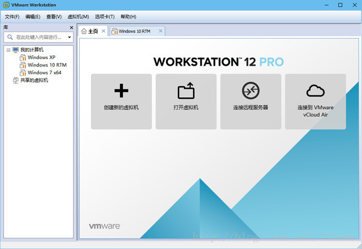
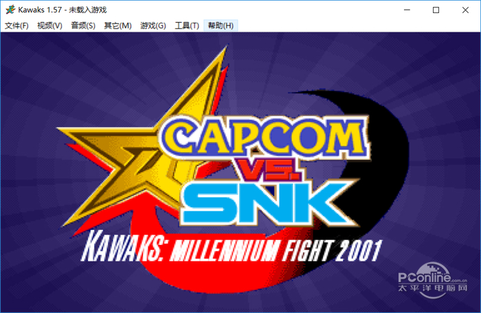
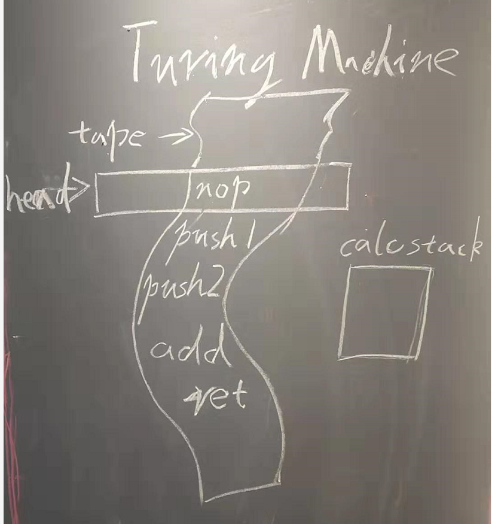
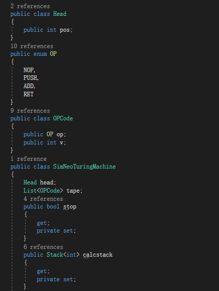

Reference source code location
https://github.com/lightszero/neovmbook/tree/master/samples/turing01

# What is NEOVM and how does it work

NEOVM is NEO's VM

The virtual machine used in Neo's blockchain system.

## 1. A simple explanation of a virtual machine

Virtual machines are virtual computers, and now we usually mention virtual machines in two typical forms.

### 1.1 One is a complete simulation of a computer

Such as hyper-V，VMWare



and arcade simulator



### 1.2 The other is simply as an execution environment

Such as JVM
Such as dotnet framework
Such as V8\lua

For developers, the implementation environment is divided into two major categories.

### 1.2.1 Public execution environment

Public execution environment, such as c# and python.

### 1.2.2 Embedded execution environment

For example, lua is a typical embedded script.

Of course, there are cases where c# and js are used as embedded scripts through mono and v8.

## 2 What is NeoVM?

NeoVM is in the form of 1.2.2 above, similar to Lua, and is an embedded execution environment.

NeoVM is a virtual machine based on Turing machine mode, which realizes logical operation by changing the state of the magnetic head by moving on the tape.

NeoVM is a separate system that does not rely on the Neo project. NeoVM only provides pure logical computing power, with extensible interoperability, and then inserts functions that the virtual machine can invoke.

NeoVM is designed more like a machine, executing a piece of code that is a block of memory that parses data into instructions on execution.

### 3 How NeoVM is executed

To explain this, we must review the Turing machine.



Ignore my ugly handwriting.

This assumes that you understand how tape music players work, or head and tape become awkward.

1.Write instructions on a tape.

2.The head reads the current instruction.

3.The instruction set is known. Four instructions are shown in the figure.

nop -- Do nothing
push[n] -- Push a number into the calcstack
add -- Take two values from calcstack, add them together, and put them back in calcstack
ret -- End current execution

4.Register space to manage state. For NeoVM, registers are two stacks, CalcStack and AltStack.

There are tapes, heads, instruction sets, and state space. This is a Turing machine.

### 4 talk is cheap

Let's look at the code.

The code is here:
samples/turing01

Less than 100 lines of code, simulating the execution of the Turing machine in that ugly picture.


The first is to prepare the tape with the code.
```
NOP
PUSH 1
PUSH 2
ADD
RET
```
Then scroll the tape and let the code roll under the head.

```
while(!vm.stop)
{
    ...
}
```
This involves the shutdown of the Turing machine, the ret instruction is to inform the shutdown, otherwise we will continue to scroll.Of course, you can also rely on the length of the tape to stop. In fact, NEOVM is designed to automatically stop when the tape runs out.I believe no one will suspect that the "retvalue" obtained by this program is 3.

Let's analyze what happened.



This is just a simulation program, one at a time, we use a class "Head" to represent the head, and a "list\<OpCode>" to represent the tape.

Tape scrolling is achieved by the accumulation of "Head.pos".

The state space is the variable of "stop" and the stack of "calcstack".


The steps to execute the instruction are written in the function StepOne.

The process of StepOne is
1.Read the code at the head of the tape;
2.Execute the code;
3.Scroll head head.pos++;

When the code is executed, it is operating the state space.

The NOP does nothing, but the NOP is still one of the most important instructions, so just treat it as a space.

RET directly causes a shutdown and the head does not scroll anymore.
The head position is also part of the state space. The instruction can cause the head position to change. This is important because the essence of the flow control is the head position change. All the "if for while" logic that ends up on the vm is changing the position of the head.

PUSH -- push a value to calcstack

ADD -- Take two values from calcstack, add them together, and put them back in calcstack.

If you run this program, breakpoints, run "StepOne" step by step, observe calcstack, you will find:

1.After nop, nothing happens;
2.After push 1，calcstack is [1]
3.After push 2，calcstack is [2,1]
4.After add，calcstack is [3]
5.After ret, stop becomes true, Then the loop is over.

This is how NEOVM works.

For NEOVM, .avm is the tape, except that avm is byte[], not structured like the "List\<Opcode>" we use here.

The purpose of this article is to explain what NEOVM is and how it works. First use this simple program to explain.

More questions, the next article continues.
