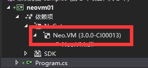
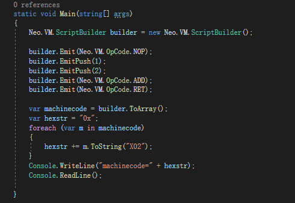
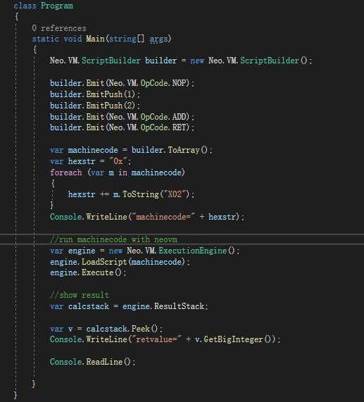

Reference source code location  
https://github.com/lightszero/neovmbook/tree/master/samples/neovm01

# Where AVM comes from - process description

Two methods for generating AVM are discussed here

1.Use an assembler helper class to directly synthesize AVM in the code through assembly code

2.Use a compiler to get AVM from a high-level language

## Assembler
It's time to talk about assembly.

This involves several concepts, assembly language, machine language and assembler.

Interestingly, you don't need to learn assembly specifically for this.

Do you remember the
```
NOP
PUSH 1
PUSH 2
ADD
RET
```
above，that's the kind of thing we could call assembly language.

NEOVM's input, which is the machine language that NEOVM emulated, is in byte[] format.

So these five instructions can be converted into a byte[] machine language that NEOVM knows.

The tool that does this is called an assembler.

Let's make an assembler.

There is a ScriptBuilder.cs in NEOVM that does most of the work of an assembler, except for link.

The problem of link is more complicated, and it is also a focus of the assembler. This requires us to have more understanding of virtual machines such as NEOVM to continue to explore.Let's focus on turning the five assembly instructions into byte[].

\*NEO used to have an official assembler project（neoa，Years of disrepair
https://github.com/neo-project/neo-compiler/tree/master/neoa

To study the compiler, the assembler is also the only way, maybe I will maintain a new assembler project.）

## Invoke ScriptBuilder to generate NEO machine code（AVM）

Let's see the code，this program is located at
samples/neovm01



Note that the reference is NeoVM of Neo3.0, This series of articles only focus on NeoVM3.0, but don't worry, NeoVM3.0 is not so different.



Import NEO.VM from nuget

Then we can use ScriptBuilder to directly complete the work of assembler, we can get
```
machinecode=0x6151529366
```
Then we let neovm execute this machine code



We can also get retvalue=3

Ok, here we know that the .avm machine language is assembled from the assembly language by the assembler. Although we didn't talk about the link, the problem is more complicated, and we will discuss it in the future.

## Where assembly language came from

The problem, then, is that you can't assemble by hand. Here is a concept of a compiler.

We need a tool to translate
```
"1+2"
```
to
```
NOP
PUSH 1
PUSH 2
ADD
RET
```

This is the job of the compiler.

Ok, let's focus on how to implement this automatic compilation of addition operations into assembly language.

## Generate NEO machine code with compiler（AVM）

Let's see the code，this program is located at  
samples/neovm02

There is an extremely simple compiler here.

He can only compile the addition of positive integers, such as

“1+2+4+5”

The source code of this simple compiler is divided into two parts. One part is to organize the source code into an abstract syntax tree (AST), which is the ParseSynatxNode function.


Then we get the abstract syntax tree of the expression "1+2+3+4".

The next step is to turn the abstract syntax tree into the code we actually want to execute.

It's also very simple, call the assembler, traversal the syntax tree by depth, get the machine code.


And then we just execute this code with neovm, and get the result 12.

## Process analysis

That's it. Let's analyze it

There should be several processes, which are often referred to as compilers in general.

    Word segment->Build an abstract syntax tree->Convert to assembly code->Convert to machine code

### 1.Word segmentation

Word segmentation is the first job of a compiler.

”1+2323+4”,The compiler cannot analyze byte by byte, first splitting the string into individual words
“1”,"+","2323","+","4"

Because our test compiler is very simple, a string.split is done.

### 2.Build an abstract syntax tree

Then there is parsing, and the most common form of organization is to generate an abstract syntax tree


"1+2+4+5" is organized into a tree.

The top node is an addition node, the left value is "1+2+4", and the right value is 5.

"1+2+4" is split into an addition node, the left value is "1+2", and the right value is 4.

"1+2" is split into an addition node, the left value is 1, and the right value is 2.

Some scripting language compilers only do this, and the abstract syntax tree is built, so that it can be interpreted and executed.

For example, the arithmetic for computing string calculations: prefix expressions, in fact, the prefix expression is an AST (abstract syntax tree).
It is then evaluated by depth traversing the tree nodes.

### 3.Convert to assembly code
Let's see here  


We traverse the tree in depth, the deepest node is 1 2.
```
PUSH 1
PUSH 2
```
Then the addition of the upper layer
```
ADD
```
the 4 in same layer.
```
PUSH 4
```
the addition of the upper layer.
```
ADD
```
the 5 in same layer.
```
PUSH 5
```
the addition of the upper layer.
```
ADD
```

So we get
```
PUSH 1
PUSH 2
ADD
PUSH 4
ADD
PUSH 5
ADD
```

Compare the code with EmitCode


We turn PUSH ADD into machine code directly with the assembler.

But what if we saved the instructions first?

You can get

```
PUSH 1
PUSH 2
ADD
PUSH 4
ADD
PUSH 5
ADD
```

### 4.Convert to machine code

According to the strict process, the output of step 3 should be assembly code
```
PUSH 1
PUSH 2
ADD
PUSH 4
ADD
PUSH 5
ADD
```
Then use the assembler to turn it into AVM.

But for now, our independent assembler project is not yet complete, so we only introduce the use of SricptBuilder as a simple assembler assistant.

Usually the compiler's own assembler, not called an assembler but a linker, is responsible for address translation. If you are familiar with c++, you must know that c++ compiler is clearly divided into compiler and link.

This article is intended to explain the production process of AVM, without going into the details of address translation.
