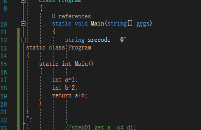
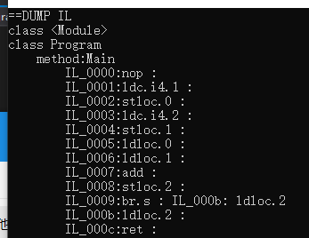
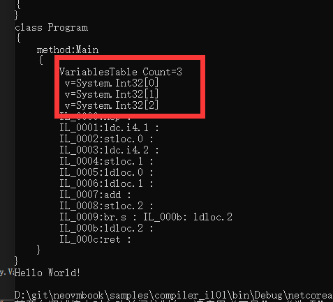
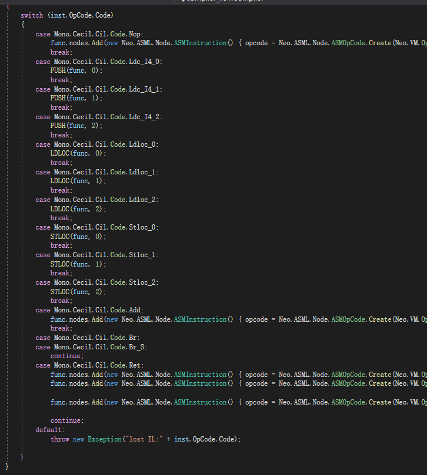

# AVM从何而来-另一种汇编语言-变量

现在我们讨论从另一种汇编语言如何编译成AVM，其实，没有什么不同

让我们以IL为例，同为栈式虚拟机，IL指令和AVM指令有很多相似之处。

与AVM不同，IL还是保留着函数级别的模块化结构，IL没有连成一个大的byte[],
而是每个函数对应一块byte[],IL的call还是函数级别的，每个函数对应的IL指令地址都从零开始，IL的jmp已经转换为了地址。



让我们还是用这个 1+2 的例子

我们把上述srccode编译成一个c#的dll，在DEBUG模式下编译，他的IL code 看起来应该是这样的



嗯，我们一条一条的来说一下

nop 空指令

loc 就是NEOVM的PUSH

stloc 把值放进变量列表

ldloc 是从变量列表中取出值

add 同NEOVM ADD

br 是NEOVM的JMP

ret 同NEOVM的 RET

这个br指令，是DEBUG模式编译产生的，RELEASE模式编译就会优化掉了，主要用RELEASE模式还会产生其它的很多优化指令，便于说明，我们先不管这个br 跳转了。

这个br跳转就是跳到下一条指令的无意义跳转，忽略它没有任何副作用。

嗯，让我们重新整理一下

```
PUSH 1
STLOC 0
PUSH 2
STLOC 1
LDLOC 0
LDLOC 1
ADD
STLOC 2
LDLOC 2
RET
```

想想上一篇出现过的伪代码
```
    //int a=1
    PUSH 1
    STLOC 0
    //int b=2
    PUSH 2
    STLOC 1
    //return a+b
    LDLOC 0
    LDLOC 1
    ADD

    RET
```
嗯，这个基本上一样不是吗？

最后的STLOC 2  和 LDLOC2 就是又弄了个临时变量，可以消去

编译器在DEBUG模式大概是这么干的
```
var c=a+b;
return c;
```

如果你上一篇，已经搞懂了，接下去你都不需要看了，因为这篇接下去的处理就是上一篇的后半部分。

IL代码里面对变量直接套用了变量列表的概念，我们上一篇讨论了如何编译变量，加一个变量列表，

IL直接有这个概念，所以我们直接翻译他的代码就是，而且上一篇我们需要统计临时变量数量，这一次都不需要，IL直接有这个数据



IL的变量表类型和索引都在

这次的代码在samples/compiler_il01

翻译工作就变得非常简单了，大部分情况下，如果搞过一个高级语言编译到到AVM。然后你再做一个高级语言的字节码编译到AVM，工作内容的后半都及其相似。


大部分的代码我们只要直接处理就可以了，逻辑和之前编译是一样的

但是有一点小麻烦在STLOC 这里

IL指令是
```
//IL CODE
LDC.i4.1
STLOC.0
```

但是我们期望翻译的结果为
```
//AVM
DUPFROMALTSTACK//array
PUSH 0//index
PUSH 1 // LDC.i4.1
SETITEM
```

其中 STLOC的代码需要把LDC的代码包在中间，也许你考虑翻一下顺序，可惜这会吧问题变得更复杂

STLOC 的意义是把计算栈栈顶的值取出放进变量列表，而不是把前一条指令取出放进

```
LDC.i4.1
LDC.i4.4
ADD
STLOC.0
```
比如在这种情况下，以上三条指令的计算结果，被放进变量列表，所以任意改动代码顺序是不可能的，所以我们怎么处理呢？

```
//AVM
PUSH 1 //LDC.i4.1
//STLOC.0 begin
DUPFROMALTSTACK//array
PUSH 0//index
PUSH 2
ROLL
SETITEM
//STLOC.0 end
```

我们插入更多的指令，让NEOVM去调整栈上的数据顺序
我们用PUSH 2，ROLL 两条指令完成了一个栈上参数顺序翻转

比如此时栈上值从底至顶 依次为 [1，varArray，0/*varindex*/]

ROLL 2 就可以把从栈顶开始索引为2的值提到栈顶

执行过ROLL 2 以后就是[varArray,0,1],就符合我们的预期了。
